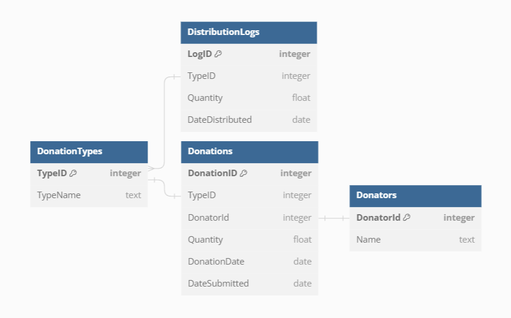

# Requirement

## Donation Registration

* A user can submit the details of a donation record

## Donation Distribution

* A user can see distribution logs that contain the type of donation, quantity, and date of distribution

## Donation Reports

* An inventory report displaying the current status of donations, grouped by type
* A donator report, summarizing the total contributions received from each donor

# Database Diagram

